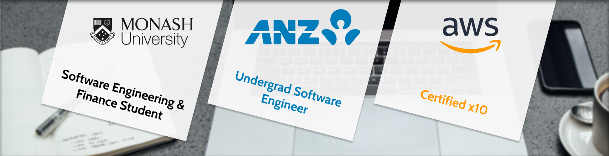

### Hi there, Patrick here! 🏀

I'm a penultimate year Software Engineering and Finance student at Monash University in Melbourne, Australia, with a 3.9 GPA and a variety of industry experience.

I also work part time as a software engineer at ANZ Bank on the Property Price Predictions team, where I get to work with AWS, Node and machine learning systems on a day-to-day basis.

### YouTube 🎥  

I'm very interested in the cloud and digital transformation. Over the past two years I've achieved 10 AWS certifications, including both Professional certs, and documented everything I've learned on my YouTube channel.

If you're interested in getting AWS certified, or even just learning more about the cloud, you'll find plenty of resources [on the channel](https://youtube.com/c/PatrickBrett1111).

### Projects 🎨 

On this Github, you will find a variety of experiments and projects. Here are some of my favourites:

---

#### [HowManyAWS](https://github.com/patrickbrett/HowManyAWS)

Amazon Web Services adds new services just about every week. How many are there right now?

🔨 Built with Lambda, JavaScript, API Gateway.

🌎 Live at [HowManyAWS.com](https://howmanyaws.com)

---

#### [Number Plate Blurrer](https://github.com/patrickbrett/number-plate-blurrer)

AI that blurs car photos to prevent number plate fraud.

🔨 Built with Angular, TypeScript, Golang, Lambda, SageMaker, Python.

🚧 Currently under construction

---

#### [Aftertax](https://github.com/patrickbrett/aftertax)

How much do you need to earn to get $2000 per week take-home?

This calculator helps you answer questions like that and more - it supports both pre/post-tax salary conversion (in both directions) and hourly-weekly-monthly-yearly conversion.

🔨 Built with React.

🧑‍💻 Can be run locally

---

#### [Victor](https://github.com/patrickbrett/victor)

What's our vector, Victor? Support Vector Machines engine and simulator.

🔨 Built with React, Node, Scikit-learn, Python, Flask.

🧑‍💻 Can be run locally

---

#### [Hamming Code Visualiser](https://github.com/patrickbrett/hamming-code-visualiser)

Hamming codes are a super cool way to make sure data doesn't get lost in transmission. This helps you see them in action.

🔨 Built with React.

🚧 Currently under construction

---

#### [S3 Plus](https://github.com/patrickbrett/s3-plus)

Do things with Amazon S3 you never thought possible. Move buckets between regions, make point-in-time copies, bulk-delete empty buckets, and other voodoo.

🔨 Built with Node and AWS SDK.

☕️ [Install via NPM](https://www.npmjs.com/package/s3-plus)

---

#### [Match the Cloud](https://github.com/patrickbrett/match-the-cloud)

Match AWS service names to their icons. Harder than it sounds...

I built this to learn VueJS.

🔨 Built with Vue.

🌎 Live at [MatchThe.Cloud](https://matchthe.cloud)

---

### Let's catch up ☕️ 

Feel free to reach out to me on [LinkedIn](https://linkedin.com/in/patrickbrett1) - I'm always down to grab a coffee or set up a Zoom call to meet new and interesting people.
